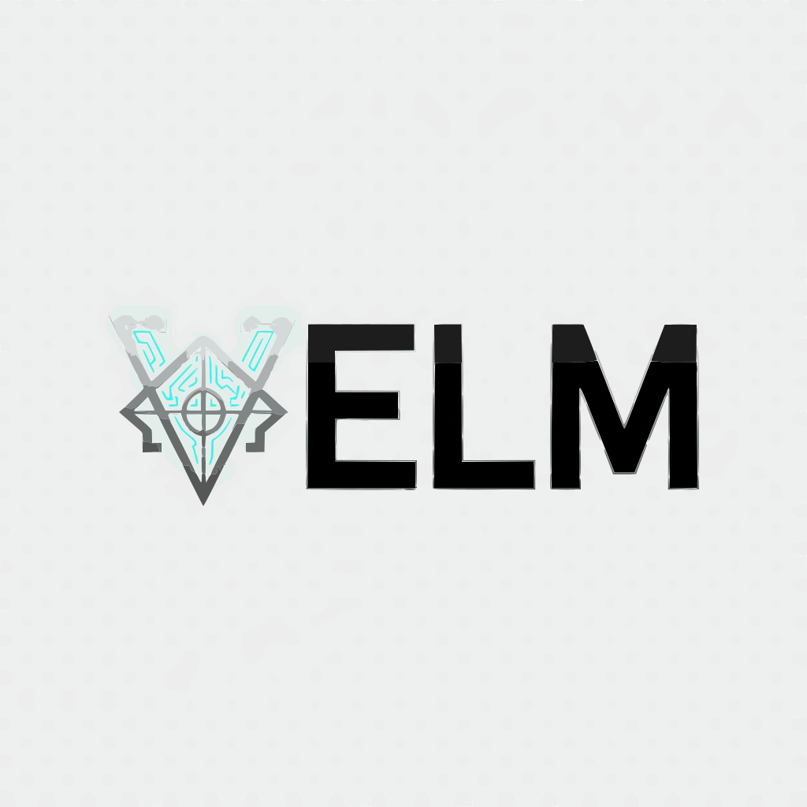
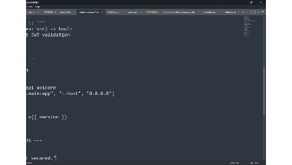

  

<h1 align="center">V E L M</h1>

  

  <strong>The Operating System for Manifestation.</strong> 
  <em>Powered by the VELM God-Engine.</em>

  
  
  
  

 

> **Architect's Note:** VELM is the public manifestation of the internal `velm` project. While the engine is largely functional and battle-tested within the Novalym Forge, it is currently in **Active Apotheosis (Work In Progress)**. You may encounter comment debris, vestigial logic, or raw Gnosis in the source. Proceed with the spirit of an explorer.

---

## 🌌 The Manifesto

**We do not write code. We manifest intent.**

Software engineering has become a fragmented hell of config files, boilerplate, and context-switching. We spend more time fighting our tools than forging our visions.

**VELM** is the answer. It is not a linter. It is not a generator. It is a **Gnostic God-Engine**—a sentient layer between your mind and the machine. It unifies the lifecycle of software development into a single, fluid symphony of **Perception**, **Cognition**, and **Kinetic Action**.

It allows you to:
1.  **Distill** chaos into structure.
2.  **Transmute** intent into code.
3.  **Weave** patterns into reality.
4.  **Resurrect** broken logic automatically.

---

## 💠 The Architecture of Will

VELM operates on a Philosophy of Duality, bridging the gap between Abstract Thought and Concrete Code.

| Concept | The Gnostic Truth |
| :--- | :--- |
| **Form** | Defined by `.scaffold` blueprints. These are static definitions of file structures, variables, and content templates. |
| **Will** | Defined by `.symphony` scripts. These are executable workflows that command the OS, verify state (`??`), and manipulate reality (`>>`). |
| **The Cortex** | The engine's memory. It indexes your project into a **Vector Lattice**, allowing it to understand the *meaning* of your code, not just the syntax. |
| **Artisans** | Specialized sub-engines (The Alchemist, The Surgeon, The Seer) that perform specific rites of creation or analysis. |

---

## ⚡ Installation

Install the engine via the Python package manager.

pip install velm

Consecrate the Alias:
To wield the power of VELM properly, bind the internal scaffold command to its true name in your shell (.zshrc or .bashrc):

alias velm="scaffold"

All documentation below assumes you have performed this binding.
🔮 The Grimoire (Capabilities)

VELM is a vast ecosystem. Its capabilities are divided into Strata based on their function in the creative loop.
I. GENESIS (The Rite of Creation)

Bringing something from the Void into Reality.

    velm init <name>
    The Rite of Inception. Initializes a new project sanctum. It engages you in a Sacred Dialogue to determine your tech stack, preferences, and variables, then materializes the foundation.

    velm genesis <blueprint>
    The God-Engine. Materializes a full project from a .scaffold blueprint or a remote URL.
    Flags: --preview (Quantum Simulation), --force (Overwrite Will).

    velm create <path> --ai-edit "prompt"
    The Sentient Hand. Creates a file instantly using AI.
    Example: velm create src/utils/math.ts --ai-edit "A library for complex vector math"

    velm dream "prompt"
    The Oneiromancer. Describe a project in natural language ("A React dashboard for crypto trading"), and VELM will hallucinate a complete file structure blueprint for it.

II. PERCEPTION (The Rite of Understanding)

Gazing into the soul of the code.

    velm distill [path]
    The Reverse Genesis. Reads an existing codebase and generates a .scaffold blueprint. Use this to capture the soul of a legacy project or to create a context file for an LLM.
    Flags: --format dossier (Creates a human-readable forensic report), --budget 100k (Token limits).

    velm analyze <file>
    The Deep Inquest. Performs static analysis, calculating complexity, finding anti-patterns, and estimating token costs.

    velm tree
    The Gnostic Surveyor. A high-fidelity visualization of your directory structure that ignores noise (node_modules, .git) and highlights complexity.

    velm graph
    The Topological Map. Generates a visual dependency graph (Mermaid/JSON) showing how your files import and rely upon one another.

III. EVOLUTION (The Rite of Change)

Mutating reality without breaking it.

    velm transmute <blueprint>
    The State Engine. Updates an existing project to match a changed blueprint. It performs a 3-way merge: The Past (Lockfile), The Present (Disk), and The Future (Blueprint).

    velm patch <file> --prepend "..."
    The Surgical Scalpel. Modifies a file's content using semantic awareness. It can append, prepend, or regex-replace content transactionally.

    velm translocate <src> <dest>
    The Grand Refactor. Moves a file and automatically updates every import statement in your entire project that references it.

    velm conform <blueprint>
    The Enforcer. Forces a project's directory structure to match a strict definition, moving files that are out of place and flagging orphans.

IV. INTELLIGENCE (The Neural Link)

Communing with the Cortex.

    velm architect "request"
    The Co-Pilot. A conversational interface where you plan complex changes with the AI. It proposes a plan, you refine it, and then it executes.

    velm ask-ai "question"
    The Oracle. Asks a question about your specific codebase. It uses RAG (Retrieval Augmented Generation) to read your project files before answering.

    velm review
    The Sentinel. Reviews your staged Git changes for security vulnerabilities, bugs, and architectural heresies.

    velm shadow spawn
    The Doppelgänger. Creates an ephemeral, isolated clone of your project (Shadow Realm) to test dangerous changes without touching your main branch.

V. OPERATIONS (The Kinetic Will)

Executing commands and managing infrastructure.

    velm run <script>
    The Universal Conductor. Executes Python scripts, Shell scripts, or .symphony workflows. It handles dependency injection and environment variables automatically.

    velm deploy
    The Celestial Forge. Inspects your code and generates production-ready Kubernetes manifests (Helm Charts) or Dockerfiles.

    velm isolate <command>
    The Supply Chain Sentinel. Runs a command (like npm install) but blocks access to public registries that aren't explicitly allow-listed.

🔮 The Visual Studio (TUI)

VELM includes a high-performance Terminal User Interface for Architects who prefer a visual cockpit.

velm studio

This launches the Obsidian Control Plane, giving you:

    The Atlas: A navigable tree of your project.

    The Forge: A drag-and-drop interface for composing blueprints.

    The Monitor: Real-time CPU/RAM/Network telemetry of your app.

    The Hive: Status of all active background daemons.

📐 Blueprint Syntax (The Language of Form)

A .scaffold file is a declarative scripture.

# == Define Variables ==
$$ project_name = "Velm-Core"
$$ author = "The Architect"

# == Define Files ==
# Syntax: path :: "content"
src/main.py :: """
print("Hello, {{ project_name }}")
"""

# == Seed from Templates ==
# Syntax: path << source
Dockerfile << templates/python.dockerfile

# == Logic Gates ==
@if {{ use_database }}
    src/db.py :: "..."
@endif

# == Kinetic Will (Post-Run) ==
%% post-run
    git init
    pip install -r requirements.txt

🤝 Contributing

We welcome Architects of all grades.

    Fork the repository.

    Transmute the code (we use black and ruff).

    Verify your changes via velm self-test.

    Submit a Pull Request.

<em>Forged in the Novalym Sanctum.</em> 
Est. 2024

